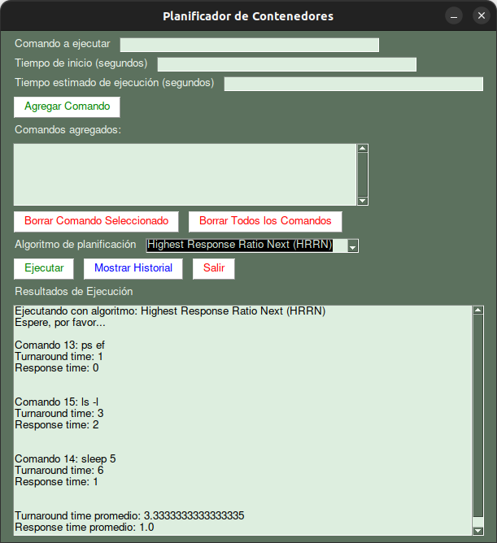

# Scheduling (Planificación): Proyecto de Sistemas Operativos

<!-- Centrar imagen gui.png -->
<p align="center">
  
</p>


Proyecto de sistemas operativos que simula el funcionamiento de un planificador de procesos en un sistema operativo.
Teniendo como procesos contenedores de docker que se ejecutan en un sistema operativo linux (alpine linux por defecto).

El proyecto se desarrolla en python y se utiliza la librería PySimpleGUI para la interfaz gráfica y psycopg2 para la conexión a la base de datos (PostgreSQL)


## Integrantes
- Elkin Samir Angulo Panameño
- Leonardo Cuadro Lopez
- Cristian Camilo Pinzón

## Requisitos
- PySimpleGUI ```pip install PySimpleGUI```
- psycopg2 ```pip install psycopg2```
- docker ```pip install docker```

## Pasos para ejecutar el proyecto

1. Clonar el repositorio
```bash
git clone git@github.com:paelsam/proyecto-so.git
```

2. Ingresar a la carpeta del proyecto
```bash
cd proyecto-so
```
3. Abrir una terminal dentro de la carpeta del proyecto

4. Crear la imagen de la aplicación y ejecutar el contenedor
```bash
docker build -t database . # Construir la imagen de la base de datos
docker run --name database_container -d -p 5432:5432 database # Crear el contenedor de la base de datos
```

5. Crear entorno virtual de python
```bash
python -m venv venv
```

6. Activar el entorno virtual
```bash
source venv/bin/activate
```

7. Ejecutar el archivo gui.py para probar la GUI
```bash 
python gui.py
```


